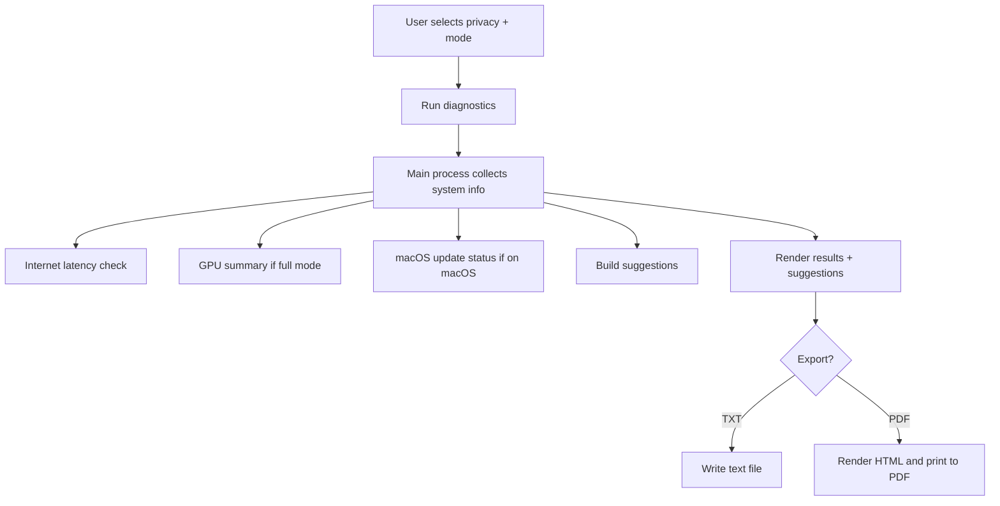

# Local Resource Diagnostic Tool

Small Windows + macOS diagnostics app with privacy controls and export.

## Run
1. Install dependencies:
   - `npm install`
2. Start the app:
   - `npm start`

## Features
- Quick or full diagnostics
  - Tests: OS info, CPU, GPU, memory, internet latency.
- Privacy mode
  - Private (default) or public (redacted)
- Export results to TXT or PDF
  - Includes optimization suggestions
- Timestamped filenames: `results_diagnostic_DDMMYY`
- Optimization suggestions based on the latest diagnostics

## Notes
- Public mode redacts username, hostname, and home paths.
- Private mode shows full system details.
- Internet check measures request latency to a public endpoint.
- Windows build uses `assets/icon-win.ico` (generated from `assets/icon-win.png`).

## Build
- Electron-based build.
- macOS helper: `./mac_diagtool_program_builder.sh`
- `npm run pack` (folder build)
- `npm run build` (installer)

## Where the executables are
- Build output goes to `dist/`.
- Windows: `*.exe` (NSIS) in `dist/`.
- macOS: `*.dmg` in `dist/`.
- Note: macOS installers are best built on macOS, and need to be built by the user because I do not have a Mac.
- The mac helper script generates `assets/icon-mac.icns` from `assets/icon-mac.png` before building.

## Credits
Source icons:
- http://toastytech.com/guis/win98.html
- https://www.aicerts.ai/news/apple-ai-strategy-the-invisible-approach-wall-street-is-questioning/

## Flow chart

